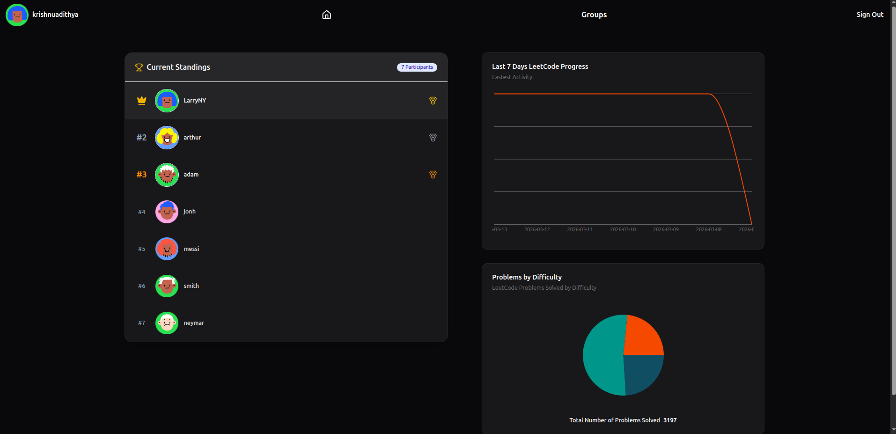
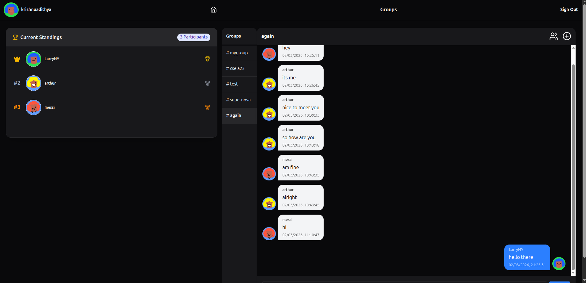

# LeetSquad

## LeetCode Performance Tracker and Dashboard

Live: https://leetsquad.vercel.app/





LeetSquad helps you track LeetCode progress and compete with friends in groups.

---

## Features

* **LeetCode Profile Sync**
  Link your LeetCode username and automatically sync solved problems and stats.

* **Progress Tracking**
  View coding activity, charts, and statistics.

* **Groups & Leaderboards**
  Create groups with friends and compare performance.

* **Realtime Chat**
  Chat with group members while solving problems.




---

## Tech Stack

* **Frontend:** React (Vite)
* **Backend:** Python API
* **Database & Auth:** Supabase
* **Realtime Messaging:** Supabase Realtime
* **Deployment:** Vercel

---

## Setup

Clone the repository

```bash
git clone https://github.com/you/leetstack.git
cd leetstack
```

---

## Backend Setup

Create a `.env` file inside **backend**

```
SUPABASE_URL=your_supabase_project_url
SUPABASE_KEY=your_supabase_secret_key
```

Run backend

```bash
cd backend
python -m venv .venv
source .venv/bin/activate
pip install -r requirements.txt
python main.py
```

Backend runs at

```
http://localhost:5000
```

---

## Frontend Setup

Create a `.env` file inside **frontend/leetsquad**

```
VITE_SUPABASE_URL=your_supabase_project_url
VITE_SUPABASE_KEY=your_supabase_public_key
```

Run frontend

```bash
cd frontend/leetsquad
npm install
npm run dev
```

Frontend runs at

```
http://localhost:5173
```
